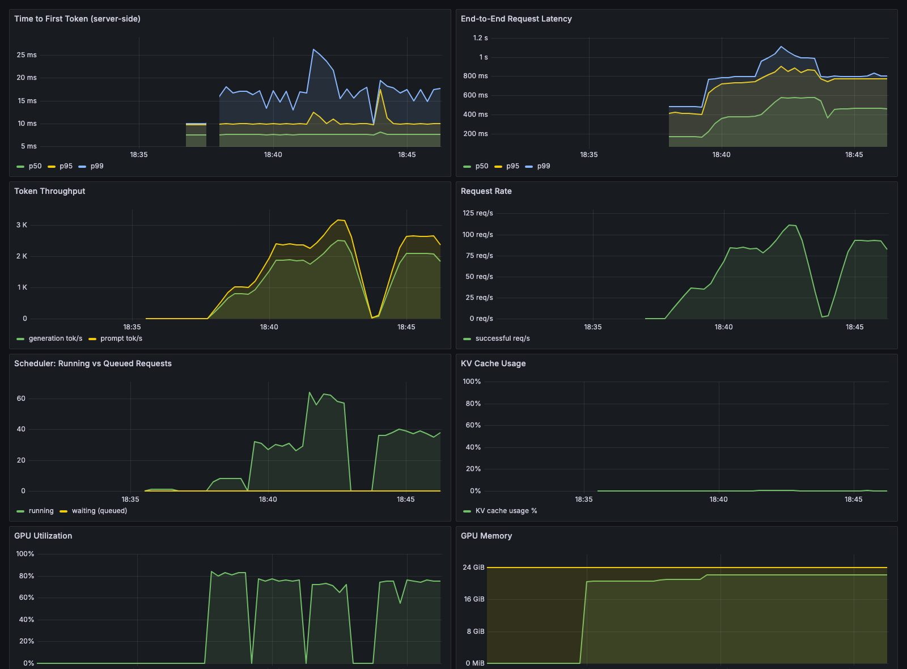

# qwen-coder-slm-stack

A production-shaped serving slice for a small open-source coding LLM, sized to
run on a single 24 GB GPU (RTX 4090) for ~$0.50/hr:

- **vLLM 0.7** serving **Qwen2.5-Coder-3B** with **FP8** weights, prefix caching,
  and **ngram speculative decoding** for FIM autocomplete
- **LiteLLM gateway** in front — OpenAI-compatible endpoints, friendly model routes
- **Prometheus + Grafana** — server-side p50/p95/p99 TTFT and e2e latency,
  tokens/sec, queue depth, KV-cache usage, GPU utilization
- **Weekly LoRA pipeline**: IDE accept/reject events → PEFT LoRA → **eval gate**
  (blocks adapters that don't beat base) → **hot-swap into the running server
  in ~1–2s, zero restart**
- FIM load-test harness with client-side percentile reporting

The same layout scales up mechanically: swap the model id, add GPUs and
replicas — the gateway, observability, and adapter pipeline don't change.

## Architecture

```
                                        ┌──────────────── GPU host ────────────────┐
 IDE / clients ──► LiteLLM gateway ────►│  vLLM 0.7 · Qwen2.5-Coder-3B · FP8       │
        (OpenAI-compatible, :4000)      │   ├─ ngram speculative decoding (perf)   │
                                        │   └─ runtime LoRA adapters (hot-swap)    │
 Grafana ◄── Prometheus ◄───────────────│  :8000/metrics   GPU exporter :9835      │
  :3000        :9090                    └──────────────────────────────────────────┘

 weekly:  IDE accept/reject events ─► train_lora.py ─► eval_gate.py ─► hotswap.py
                                                        (blocks bad adapters)
```

## Quickstart

### Split mode (GPU pod + local gateway/observability) — cheapest

On a GPU pod (RunPod/Vast, RTX 4090, expose ports 8000 and 9835):

```bash
git clone <this repo> && cd qwen-coder-slm-stack
bash scripts/pod_setup.sh lora     # or: perf
```

Locally:

```bash
cp .env.example .env               # set VLLM_API_BASE to the pod URL
# point the prometheus targets at the pod (see comments in configs/prometheus.yml)
docker compose up -d
```

- Gateway: `http://localhost:4000/v1` (key: `LITELLM_MASTER_KEY`)
- Grafana: `http://localhost:3000` → dashboard "Coder SLM — Serving Overview"

### Full-stack mode (single GPU VM with docker)

```bash
docker compose --profile gpu-lora up -d    # LoRA hot-swap serving
docker compose --profile gpu-perf up -d    # FP8 + speculative decoding
```

The profiles are mutually exclusive by design — see "Known constraints".

### Smoke test

```bash
curl -s http://localhost:4000/v1/completions \
  -H "Authorization: Bearer sk-demo-1234" -H "Content-Type: application/json" \
  -d '{"model": "coder-3b", "prompt": "<|fim_prefix|>def fib(n):\n    <|fim_suffix|>\n<|fim_middle|>", "max_tokens": 32}' | jq .
```

## The LoRA pipeline (train → gate → hot-swap)

On the GPU host:

```bash
pip install -r training/requirements.txt

python training/generate_synthetic_events.py        # or drop in real IDE telemetry
python training/train_lora.py --out adapters/customer-a

python evals/eval_gate.py --candidate customer-a \
  && python serving/hotswap.py --name customer-a --path "$(pwd)/adapters/customer-a"
```

The eval gate calls the serving endpoint for both base and candidate on a
held-out FIM set and **exits non-zero unless the adapter clears an absolute
pass-rate floor and a lift threshold over base** — so a bad training run can
never reach traffic. The hot-swap uses vLLM's runtime adapter API: the adapter
is live in ~1–2 s with no restart and no dropped in-flight requests.

The synthetic corpus simulates customer-private code via a fictional internal
SDK (`flowlite`) that no base model has seen — so the measured lift on the
held-out eval is real and attributable to the adapter, not noise.

## Load testing

```bash
pip install httpx
python loadtest/fim_loadtest.py --concurrency 32 --duration 120
```

Client-side numbers include network RTT; judge latency targets on the
**server-side** TTFT histograms in Grafana (vLLM's own metrics).

## Results

Measured on 1× RTX 4090, vLLM 0.7.3, Qwen2.5-Coder-3B FP8 (full card:
[benchmark_card/BENCHMARK_CARD.md](benchmark_card/BENCHMARK_CARD.md)):

- **FIM autocomplete TTFT p50: 14–21 ms** across concurrency 8→64 — vs. the
  80 ms Deliverable-1 target (4–5× headroom). Zero errors over 25,000+ requests.
- **Throughput** up to **107 req/s / 2,409 output tok/s** on a single 4090
  (≈ **$0.08 / 1M output tokens**).
- **LoRA hot-swap in 0.77 s, zero restart**; eval gate blocks adapters that
  don't beat base (measured base 0% → adapter 100% on a held-out FIM eval).



## Repo layout

```
configs/            litellm, prometheus, grafana provisioning + dashboard
scripts/            pod bootstrap, GPU metrics exporter
training/           synthetic IDE-event generator, LoRA trainer
evals/              held-out eval set + promotion gate
serving/            runtime adapter hot-swap
loadtest/           FIM autocomplete load generator
benchmark_card/     signed benchmark card template
RUNBOOK.md          deploy / rollback / retrain / failure modes
```

## Known constraints & design notes

- **LoRA × speculative decoding**: vLLM 0.7 cannot combine runtime LoRA with
  speculative decoding in one engine. In production you either dedicate
  replicas per mode behind the gateway, or merge adapter weights weekly instead
  of runtime swapping. This repo makes the trade-off explicit via the two
  compose profiles.
- **Qwen2.5-Coder-3B license**: the 3B checkpoint ships under the *Qwen
  Research License* (non-commercial) — unlike the Apache-2.0 0.5B/1.5B/7B/14B/32B
  sizes. Confirm licensing before commercial deployment, or set
  `MODEL_ID=Qwen/Qwen2.5-Coder-1.5B`.
- **FP8**: needs Ada/Hopper (compute capability ≥ 8.9) for hardware FP8; on
  Ampere, vLLM falls back to weight-only FP8 (Marlin) — still correct, less win.
- **v0 engine pinned** (`VLLM_USE_V1=0`): ngram speculative decoding and
  runtime LoRA updates are v0-engine features in the 0.7.x line.

## License

MIT
